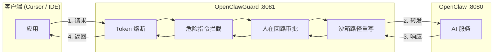
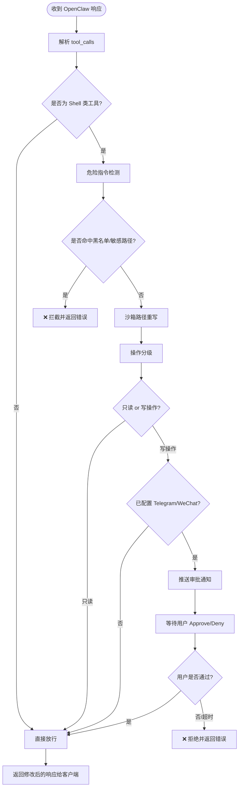
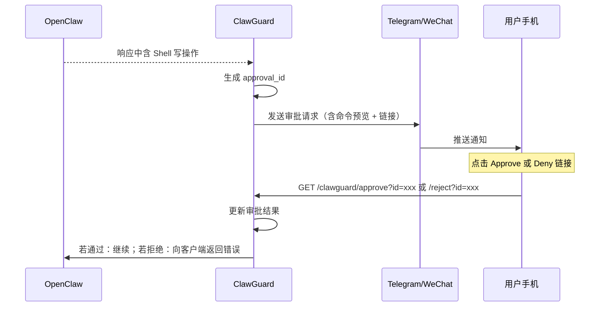
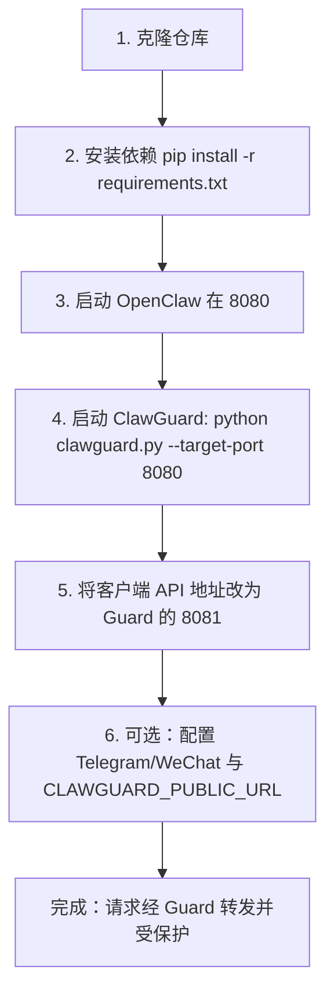
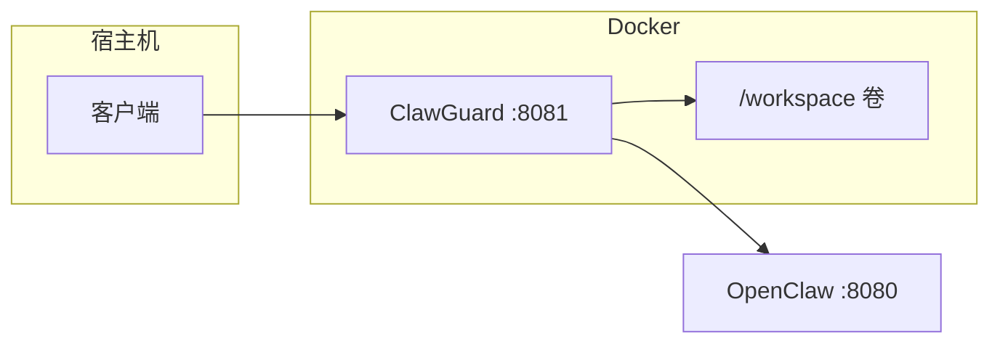

# OpenClawGuard 使用说明 (User Guide)

本文档说明如何安装、配置和使用 OpenClawGuard，并配有**流程图**与配置示例。

> **配图说明**：下文所有流程图均为 Mermaid 格式，在 GitHub、VS Code、Typora 等中可直接渲染。若需 PNG/SVG 配图，请将对应 Mermaid 代码复制到 [Mermaid Live Editor](https://mermaid.live) 导出。

---

## 一、整体架构

OpenClawGuard 作为**反向代理**部署在客户端与 OpenClaw 之间：所有请求先经过 Guard，经安全校验和审批后再转发给 OpenClaw。



**数据流简述**：客户端 → Guard（熔断 → 拦截 → 审批 → 沙箱）→ OpenClaw → 原路返回。

---

## 二、请求处理流程（含 Shell 指令）

当 OpenClaw 返回的响应中包含「执行 Shell」的 tool call 时，Guard 会按以下流程处理：



**要点**：

- **危险指令**：直接拦截，不进入审批。
- **只读操作**（如 `ls`、`cat`）：自动放行。
- **写操作**：若已配置通知则推送，等待一键 Approve/Deny 后再放行或拒绝。

---

## 三、人在回路审批流程

写操作且已配置 Telegram 或 WeChat 时，审批流程如下：



**一键链接说明**：通知内容中包含两条链接，例如：

- **Approve**：`https://your-guard-host/clawguard/approve?id=<approval_id>`
- **Deny**：`https://your-guard-host/clawguard/reject?id=<approval_id>`

请将 `CLAWGUARD_PUBLIC_URL` 配置为 Guard 对外可访问的地址，以便在手机浏览器中点击链接即可完成审批。

---

## 四、快速上手（步骤图）



### 4.1 安装与运行

```bash
# 1. 克隆
git clone https://github.com/taosin/openclaw-guard.git
cd openclaw-guard

# 2. 安装依赖
pip install -r requirements.txt

# 3. 确保 OpenClaw 已在目标端口运行（例如 8080）

# 4. 启动 Guard（Guard 监听 8081，转发到 8080）
python clawguard.py --target-port 8080
```

### 4.2 客户端配置

将原先指向 OpenClaw 的 **Base URL / 端口** 改为 Guard 的地址：

- **原**：`http://localhost:8080`（OpenClaw）
- **现**：`http://localhost:8081`（ClawGuard）

之后所有请求都会先经过 Guard，再转发到 OpenClaw。

---

## 五、配置说明

### 5.1 常用环境变量

| 变量                           | 说明                        | 示例                        |
| ------------------------------ | --------------------------- | --------------------------- |
| `CLAWGUARD_TARGET_PORT`        | OpenClaw 端口               | `8080`                      |
| `CLAWGUARD_PORT`               | Guard 监听端口              | `8081`                      |
| `CLAWGUARD_SANDBOX`            | 沙箱目录（AI 仅能读写此下） | `/workspace`                |
| `CLAWGUARD_TOKEN_LIMIT`        | Token 熔断上限              | `100000`                    |
| `CLAWGUARD_TOKEN_WINDOW_SEC`   | 熔断窗口（秒），86400=每日  | `86400`                     |
| `CLAWGUARD_PUBLIC_URL`         | 审批链接使用的 Base URL     | `https://guard.example.com` |
| `CLAWGUARD_TELEGRAM_BOT_TOKEN` | Telegram Bot Token          | 从 @BotFather 获取          |
| `CLAWGUARD_TELEGRAM_CHAT_ID`   | Telegram 对话 ID            | 数字或 @username            |

### 5.2 仅用 HTTP 审批（不配 Telegram/WeChat）

不配置 Telegram/WeChat 时，写操作会直接放行。若仍希望人工审批，可：

1. 在 Guard 日志或后续扩展的「待审批列表」中查看 `approval_id`。
2. 在浏览器或 curl 中访问：
   - 通过：`http://localhost:8081/clawguard/approve?id=<approval_id>`
   - 拒绝：`http://localhost:8081/clawguard/reject?id=<approval_id>`

当前通知中的一键链接依赖 `CLAWGUARD_PUBLIC_URL`；若仅本机使用，可设为 `http://localhost:8081`。

### 5.3 每日 Token 额度

将熔断窗口设为 24 小时即可实现「每日额度」：

```bash
export CLAWGUARD_TOKEN_LIMIT=50000
export CLAWGUARD_TOKEN_WINDOW_SEC=86400
```

---

## 六、Docker 一键部署



步骤：

```bash
cp docker-compose.example.yml docker-compose.yml
# 按需编辑 env（如 CLAWGUARD_PUBLIC_URL、Telegram 等）
docker compose up -d
```

若 OpenClaw 跑在宿主机，保持示例中的 `CLAWGUARD_TARGET_HOST=host.docker.internal` 即可。

---

## 七、功能与行为速览

| 功能             | 行为                                                                                 |
| ---------------- | ------------------------------------------------------------------------------------ |
| **危险指令拦截** | `rm -rf`、`mkfs`、`dd`、`chmod 777`、访问 `/etc`、`~/.ssh`、`System32` 等 → 直接拦截 |
| **只读自动通过** | `ls`、`cat`、`pwd`、`echo`、`grep`、`find` 等无写操作 → 不弹审批                     |
| **写操作审批**   | 含 `>`、`>>`、`tee`、`cp`、`mv`、`mkdir`、`touch` 等 → 推送审批，一键 Approve/Deny   |
| **沙箱**         | 将绝对路径重写到 `/workspace`（或 `CLAWGUARD_SANDBOX`），保护根目录                  |
| **Token 熔断**   | 窗口内超过 `CLAWGUARD_TOKEN_LIMIT` 即拒绝新请求，直至窗口重置                        |

---

## 八、常见问题

**Q：客户端报 502 / 连接被拒绝**  
A：检查 OpenClaw 是否已在 `CLAWGUARD_TARGET_HOST:CLAWGUARD_TARGET_PORT` 运行；若 Guard 在 Docker 内，宿主机 OpenClaw 需用 `host.docker.internal`。

**Q：手机收不到审批通知**  
A：确认已设置 `CLAWGUARD_TELEGRAM_BOT_TOKEN` 与 `CLAWGUARD_TELEGRAM_CHAT_ID`（或 WeChat Webhook），且 Guard 能访问 Telegram/WeChat API。

**Q：点击 Approve 链接没反应**  
A：确认 `CLAWGUARD_PUBLIC_URL` 与手机实际访问的 Guard 地址一致（若 Guard 在本地，手机需与电脑同一网络并改用电脑 IP，如 `http://192.168.1.100:8081`）。

**Q：希望不做沙箱重写**  
A：启动时加 `--no-sandbox`，或设置 `CLAWGUARD_SANDBOX_ENABLED=false`。

---

## 九、流程图汇总（导出为图片）

若需将流程图导出为图片，可：

1. **GitHub / VS Code**：直接打开本 Markdown，支持 Mermaid 渲染。
2. **在线工具**：将 Mermaid 代码复制到 [Mermaid Live Editor](https://mermaid.live) 导出 PNG/SVG。
3. **命令行**：使用 `@mermaid-js/mermaid-cli` 将 `.md` 或 `.mmd` 转为图片。

以上内容即 OpenClawGuard 的完整使用说明与配图（流程图）。  
更多需求符合性说明见 [REQUIREMENTS_COMPLIANCE.md](REQUIREMENTS_COMPLIANCE.md)。
